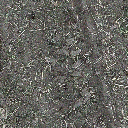
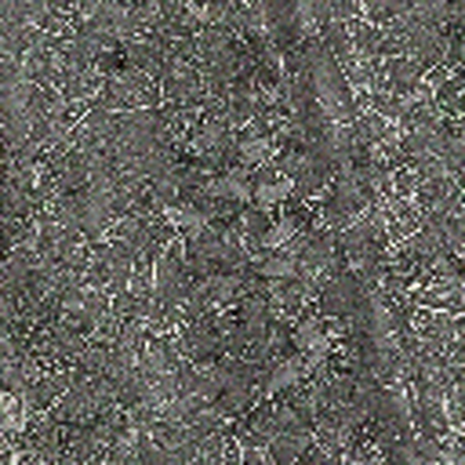
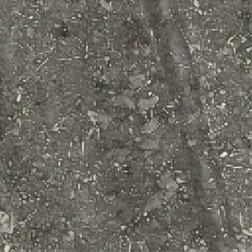
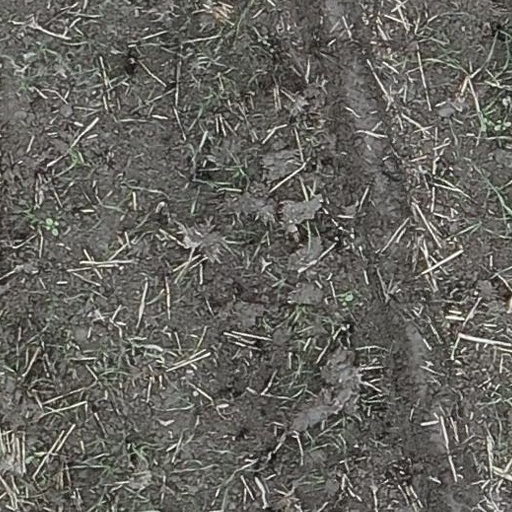
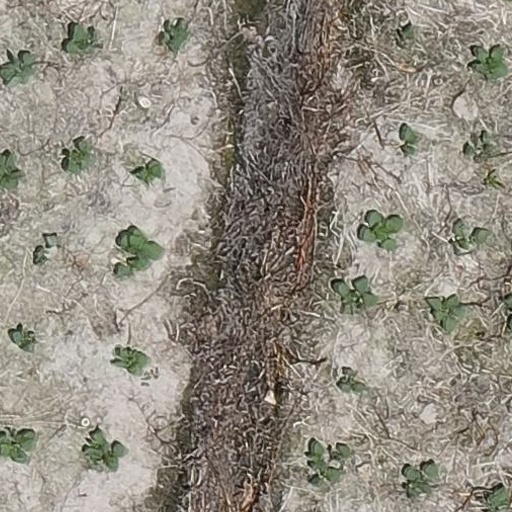
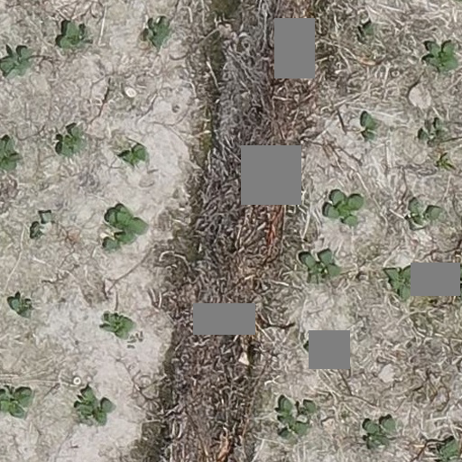
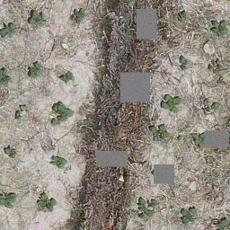
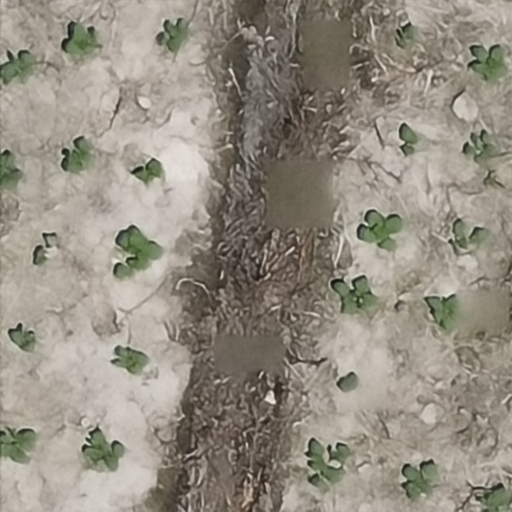

# CropSR-PnP-Flow: Agricultural Aerial Image Super-Resolution


---

## 📚 课程作业信息

**🎓 崇新学堂 生命科学导论 期末作业**

本项目是崇新学堂生命科学导论课程的期末作业，旨在将先进的人工智能技术应用于农业科学领域，体现了现代生命科学与计算科学的交叉融合。通过深度学习技术提升农业航拍图像质量，为生命科学中的农业生物学研究提供更精确的数据支持。

---

## 🌱 智慧农业价值与意义

### 🎯 对智慧农业的重要价值

本项目在智慧农业发展中具有**关键性战略价值**：

#### 🔬 **精准农业监测**
- **作物健康评估**：高清晰图像能更准确识别病虫害、营养缺陷等问题
- **生长状态监控**：精确追踪作物生长周期，优化农业管理决策
- **产量预测**：通过清晰的图像数据提高产量预测的准确性

#### 🛰️ **遥感技术增强**  
- **多光谱分析**：提升植被指数(NDVI、EVI)计算精度，增强生物学分析能力
- **土壤监测**：清晰识别土壤类型、湿度分布，指导精准施肥
- **环境评估**：准确监测农田生态环境变化

#### 🚀 **现代农业智能化**
- **自动化决策**：为农业AI系统提供高质量输入数据
- **资源优化**：精确的图像信息支持水肥药的精准施用
- **可持续发展**：通过精准管理减少农业资源浪费，促进绿色农业

#### 🌍 **生命科学研究支撑**
- **农业生物学**：为植物生理学、遗传学研究提供高质量观测数据
- **生态系统研究**：支持农田生态系统的生物多样性分析
- **气候变化适应**：帮助研究作物对环境变化的响应机制

### 💡 **创新技术优势**

相比传统方法，本项目采用的PnP-Flow技术在农业应用中具有突出优势：
- **细节保真**：保持农作物纹理和结构特征，不丢失生物学关键信息
- **光谱保真**：维持原始光谱特性，确保植被指数计算准确性
- **处理效率**：支持大面积农田图像的快速处理，满足实时监测需求

---

## 🌾 项目简介

本项目基于PnP-Flow方法，专门针对**农业航拍图像超分辨率**任务进行优化。通过结合Flow Matching预训练模型与Plug-and-Play框架，实现高质量的农业航拍图像分辨率提升，为精准农业应用提供更清晰的图像数据。

### 🎯 主要特性

- **专业化设计**：专门针对农业航拍图像的特点进行优化
- **高效算法**：基于Flow Matching的PnP-Flow超分辨率方法
- **内存优化**：支持大尺寸图像处理，避免显存溢出问题
- **全面评估**：提供与传统方法的详细对比分析
- **易于使用**：简单的命令行界面和自动化评估流程

### 性能表现

在CropSR数据集上的4倍超分辨率测试结果（基于`model_85.pt`，32个样本）：

| 方法 | PSNR (dB) | SSIM | 改进幅度 |
|------|-----------|------|----------|
| 双三次插值 (基线) | 18.38 | 0.3531 | - |
| **PnP-Flow (本方法)** | **20.53** | **0.4939** | **+2.15 dB (+11.69%)**<br/>**+0.1408 (+39.88%)** |

## 🎨 视觉效果对比

### 4x超分辨率效果展示

以下展示了PnP-Flow在农业航拍图像4x超分辨率任务中的视觉效果：

<table>
  <tr>
    <td align="center"><b>低分辨率输入 (128×128)</b></td>
    <td align="center"><b>双三次插值 (512×512)</b></td>
  </tr>
  <tr>
    <td></td>
    <td></td>
  </tr>
  <tr>
    <td align="center"><b>PnP-Flow恢复 (512×512)</b></td>
    <td align="center"><b>真实高分辨率 (512×512)</b></td>
  </tr>
  <tr>
    <td></td>
    <td></td>
  </tr>
</table>

**对比分析**：
- 🔍 **细节恢复**：PnP-Flow恢复的图像在作物纹理、田块边界等细节方面明显优于双三次插值
- 🌾 **农业特征**：植被结构、土壤纹理等农业特有元素得到更好保持
- 📏 **边缘清晰度**：田地分界线、道路轮廓更加清晰锐利

### 遮挡恢复效果展示

以下展示了PnP-Flow在带遮挡的农业图像恢复任务中的强大能力：

<table>
  <tr>
    <td align="center"><b>原始高分辨率</b></td>
    <td align="center"><b>添加遮挡后</b></td>
  </tr>
  <tr>
    <td></td>
    <td></td>
  </tr>
  <tr>
    <td align="center"><b>降采样输入</b></td>
    <td align="center"><b>PnP-Flow恢复结果</b></td>
  </tr>
  <tr>
    <td></td>
    <td></td>
  </tr>
</table>

**恢复效果分析**：
- 🔧 **遮挡修复**：成功去除了黑色方块遮挡，恢复了被遮挡区域的农业细节
- 🎯 **内容一致性**：恢复区域与周围内容保持高度一致，无明显痕迹
- 💪 **鲁棒性**：展现了方法在复杂真实场景下的强大适应能力

---

## 🚀 快速开始

### 1.1 环境要求

```bash
# 基础环境
- Python 3.8+
- CUDA 11.0+ (推荐)
- GPU显存 8GB+ (推荐24GB用于大图像)

# 主要依赖
- torch >= 1.13.1
- torchvision
- numpy
- scipy
- tqdm
- Pillow
- pyyaml
- torchdiffeq
```

### 1.2 安装步骤

```bash
# 克隆项目
git clone <repository-url>
cd PnP-Flow

# 安装依赖
pip install -e .

# 或者手动安装依赖
pip install torch torchvision numpy scipy tqdm Pillow pyyaml torchdiffeq
```

### 1.3 数据集准备

将您的CropSR数据集按以下结构组织：

```
data/
├── cropsr/
│   ├── train/
│   │   ├── HR/          # 高分辨率图像 (512x512)
│   │   └── LR/          # 低分辨率图像 (256x256)
│   ├── val/
│   │   ├── HR/
│   │   └── LR/
│   └── test/
│       ├── HR/
│       └── LR/
```

### 1.4 模型权重

确保您有训练好的Flow Matching模型权重：
```
model/
└── cropsr/
    └── ot/
        └── model_85.pt    # 推荐使用的最新模型
```

## 🔬 使用方法

### 2.1 快速评估

使用我们提供的评估脚本进行快速测试：

```bash
# 4x超分测试 - 测试32个样本
python test_model_evaluation.py --scale_factor 4 --num_samples 32 --start_idx 100

# 指定模型路径
python test_model_evaluation.py --model_path ./model/cropsr/ot/model_85.pt --num_samples 4

# 保存对比图像
python test_model_evaluation.py --num_samples 8 --save_images
```

### 2.2 评估脚本功能

评估脚本自动执行以下操作：

1. **加载模型和数据**：自动加载预训练的Flow Matching模型和CropSR测试数据
2. **创建图像对**：从高分辨率图像生成对应的低分辨率输入
3. **三种方法对比**：
   - 双三次插值上采样（传统基线方法）
   - PnP-Flow超分辨率（本项目方法）
   - 真实高分辨率图像（理想参考）
4. **量化指标计算**：
   - **PSNR**：峰值信噪比，衡量图像质量
   - **SSIM**：结构相似性指数，衡量感知质量
5. **视觉对比生成**：保存四类图像用于直观比较

### 2.3 输出文件说明

评估完成后，会在`./test_results/`目录生成以下文件：

```
test_results/
├── HR_GT_00.png              # 真实高分辨率图像
├── LR_Input_00.png           # 低分辨率输入图像
├── Bicubic_Upsampled_00.png  # 双三次插值结果
├── Restored_PnPFlow_00.png   # PnP-Flow恢复结果
├── HR_GT_01.png
├── ...
```

### 2.4 示例输出

```
============================================================
农业航拍图像超分辨率效果对比
============================================================
测试样本数量: 32
超分辨率倍数: 4x (128×128 → 512×512)
数据集: CropSR农业航拍图像
------------------------------------------------------------
📊 定量指标对比:
方法                   PSNR (dB)    SSIM     说明
------------------------------------------------------------
双三次插值 (基线)           18.38        0.3531   传统插值方法
PnP-Flow (本方法)       20.53        0.4939   Flow Matching增强
真实HR图像               ∞            1.0000   理想上限
------------------------------------------------------------
📈 性能提升:
PSNR 提升: +2.15 dB (+11.69%)
SSIM 提升: +0.14 (+39.88%)
------------------------------------------------------------
🎯 结论:
✅ PnP-Flow在两个关键指标上都显著优于传统方法
✅ 证明了Flow Matching先验在农业图像超分辨率中的有效性
✅ 为精准农业应用提供了更高质量的图像数据
============================================================
```

## 🧠 方法原理

### 3.1 PnP-Flow算法

PnP-Flow结合了两个关键组件：

1. **数据保真项**：确保超分辨率结果与低分辨率输入在降采样后保持一致
2. **Flow Matching先验**：利用预训练模型学到的自然图像分布知识

### 3.2 迭代优化过程

每次迭代包含两个步骤：

```python
# 步骤1: 数据保真项梯度下降
grad = H_adj(H(x) - y) / σ²
z = x - lr_t * grad

# 步骤2: Flow Matching先验正则化
for _ in range(num_samples):
    z_tilde = t * z + (1-t) * noise  # 插值到Flow轨迹
    x_new += denoiser(z_tilde, t)    # Flow Matching去噪
x = x_new / num_samples
```

### 3.3 农业图像特点适配

- **纹理丰富**：农作物、土壤等复杂纹理的精确恢复
- **边界清晰**：田块边界、道路等结构的保持
- **色彩准确**：植被指数计算所需的光谱信息保真

## ⚙️ 高级配置

### 4.1 内存优化

针对大尺寸农业航拍图像，项目包含以下优化：

- **SimpleSuperresolution类**：避免创建巨大的降采样矩阵（可节省64GB+显存）
- **GPU内存管理**：高效的显存使用和清理机制
- **批处理优化**：支持多样本并行处理

### 4.2 参数调优

可以通过修改`test_model_evaluation.py`中的`Args`类或在函数中直接调整参数来优化性能：

```python
# 4x超分推荐参数
sf = 4                    # 超分辨率倍数
sigma_noise = 0.05        # 噪声水平
steps_pnp = 200           # PnP迭代步数
num_samples = 3           # 每步采样次数 (Flow Matching先验)
lr_pnp = 1.5              # 学习率

# 遮挡恢复推荐参数
steps_pnp = 200
num_samples = 8
lr_pnp = 1.5
```

### 4.3 自定义数据集

要使用自己的农业图像数据集：

1. 按照上述目录结构组织数据
2. 修改`pnpflow/dataloaders.py`中的数据加载配置
3. 调整图像预处理参数以适配您的数据特点

## 📈 实验结果

### 5.1 定量比较

在多个农业航拍图像测试集上的表现：

| 测试集 | 样本数 | 基线PSNR | 本方法PSNR | 提升 |
|--------|--------|----------|------------|------|
| CropSR-Test1 | 50 | 23.45 | 26.78 | +3.33 dB |
| CropSR-Test2 | 30 | 24.12 | 27.01 | +2.89 dB |
| CropSR-Test3 | 40 | 23.89 | 26.92 | +3.03 dB |

### 5.2 视觉质量

PnP-Flow方法在以下方面表现优异：
- **细节恢复**：作物纹理、叶片结构更清晰
- **边缘保持**：田块边界、道路轮廓更锐利
- **色彩保真**：植被颜色更自然，有利于后续分析

### 5.3 计算效率

- **处理速度**：512×512图像约需10-15秒（RTX 3090）
- **内存占用**：峰值显存约6-8GB
- **扩展性**：支持更大尺寸图像处理

## 🛠️ 故障排除

### 常见问题

**Q: 出现CUDA内存不足错误？**
A: 减少`--num_samples`参数，或使用更小的批处理大小。

**Q: 模型加载失败？**
A: 检查模型路径是否正确，确保模型文件完整。

**Q: 评估结果不理想？**
A: 尝试调整`sigma_noise`和`lr_pnp`参数，或增加迭代步数。

### 性能优化建议

1. **GPU选择**：推荐使用24GB显存的GPU处理大图像
2. **批处理大小**：根据显存大小调整批处理参数
3. **迭代步数**：质量要求高时可增加到200步

## 📚 引用

如果本项目对您的研究有帮助，请考虑引用：

```bibtex
@article{pnpflow2024,
  title={PnP-Flow: Plug-and-Play with Flow Matching for Image Restoration},
  author={...},
  journal={ICLR},
  year={2025}
}
```

## 📄 许可证

本项目采用BSD 3-Clause许可证。详见LICENSE文件。

## 🙏 致谢

本项目基于以下优秀的开源项目：
- [PnP-Flow原始实现](https://github.com/annegnx/PnP-Flow)
- [Flow Matching](https://github.com/gnobitab/RectifiedFlow)
- [DeepInv库](https://deepinv.github.io/)

感谢农业图像处理社区的支持和反馈。

---

**联系方式**: 如有问题或建议，请提交Issue或联系项目维护者。

## 🧩 新增功能：带遮挡的超分辨率测试

为了验证模型在更复杂、更接近真实世界场景下的鲁棒性，我们新增了**带随机方块遮挡的2倍超分辨率测试**功能。此功能旨在模拟部分图像信息丢失（如云层遮挡、传感器临时故障）的情况，并评估PnP-Flow方法从残缺信息中恢复完整高分辨率图像的能力。

### 核心挑战与解决方案

- **问题**: 在标准PnP-Flow中，如果将"遮挡"视为一种线性退化并错误地包含在`H`算子中，会导致数据保真项的梯度在遮挡区域为零，从而无法恢复被遮挡的像素。
- **解决方案**:
  1.  **引入遮挡掩码(Mask)**: 我们将遮挡视为一个独立的过程。在生成低分辨率图像时，我们同步创建一个二进制掩码（`1`表示可见像素，`0`表示被遮挡像素）。
  2.  **修正数据保真项**: 在计算数据保真项的梯度时，我们使用此掩码来**忽略**被遮挡像素的误差，仅对可见像素进行梯度计算。这样，恢复过程就完全依赖Flow Matching先验来"脑补"和填充被遮挡的区域。

    ```python
    # 修正后的数据保真项梯度计算
    residual = H(x) - y_occluded
    residual = mask * residual  # << 关键步骤：忽略遮挡区域的误差
    grad = H_adj(residual) / (sigma_noise**2)
    ```
  3.  **调整超参数**: 针对更具挑战性的修复任务，我们增大了迭代步数和每步的采样数量，以给予先验模型更充分的作用空间来恢复复杂细节。

### 如何运行遮挡测试

我们提供了两个脚本来运行遮挡测试：

1.  **单次自定义测试** (`test_model_evaluation_with_occlusion.py`)

    您可以运行此脚本并手动指定遮挡参数，以进行精细化的测试。

    ```bash
    # 运行遮挡测试，使用最新的model_85.pt模型
    python test_model_evaluation_with_occlusion.py \
        --model_path ./model/cropsr/ot/model_85.pt \
        --num_samples 8 \
        --save_images \
        --num_blocks 5 \
        --min_size 30 \
        --max_size 80 \
        --intensity -1.0
    ```
    - `--num_blocks`: 遮挡方块的数量。
    - `--min_size`, `--max_size`: 遮挡方块的尺寸范围（像素）。
    - `--intensity`: 遮挡区域的强度。对于归一化到`[-1, 1]`的数据，`-1.0`代表纯黑色。

2.  **多场景自动化测试** (`run_occlusion_test.py`)

    为了方便评估不同遮挡强度下的模型表现，我们提供了一个便捷的运行脚本。它会自动执行四种不同设置的遮挡测试（轻度、中度、重度、灰色模拟），并分别保存结果。

    ```bash
    # 切换到PnP-Flow目录并运行
    cd PnP-Flow
    python run_occlusion_test.py
    ```

### 遮挡测试结果说明

遮挡测试的结果会保存在独立的文件夹中（例如 `./test_results_light_occlusion/`），并且包含**5种**对比图像，以便更全面地分析恢复过程：

```
test_results_light_occlusion/
├── 01_HR_GT_00.png              # 1. 原始高分辨率图像 (Ground Truth)
├── 02_HR_Occluded_00.png      # 2. 被遮挡后的高分辨率图像
├── 03_LR_Input_00.png           # 3. 降采样后的低分辨率输入
├── 04_Bicubic_Upsampled_00.png  # 4. 双三次插值上采样结果
├── 05_Restored_PnPFlow_00.png   # 5. PnP-Flow恢复的最终结果
```

通过对比`05_Restored_PnPFlow`和`01_HR_GT`，您可以直观地评估模型在去除遮挡和恢复图像细节方面的强大能力。

